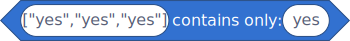
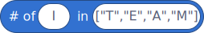

# Extra Array

### Description
Some Misc Tools For Handling Arrays!
#### Plans
Just to add stuff as I need it really...
# Contents

- [Search Array](#search-array)
- [Contains Only?](#contains-only)
- [Insert Every](#insert-every)
- [Count Occurrences](#count-occurrences)
- [#Pop]()
# Blocks

#### Search Array
Search an array for a certain query!

`Reporter`


Returns:
```json
["Waldo","Waldo & co"]
```

#### Contains Only?
Check if an array only contains a certain query

`Boolean`



Returns:
```
true
```

#### Insert Every
Insert an item every `[number]` of items in an array

`Reporter`


Returns:
```json
["header","---","body","---","footer","---"]
```

#### Count Occurrences
Return the number of occurrences of a certain query in an array

`Reporter`



Returns:
```number
0
```

#### Pop
Removes the last item in an array Or the last character of a string.

`Reporter`


Returns:
```json
["😭"]
```